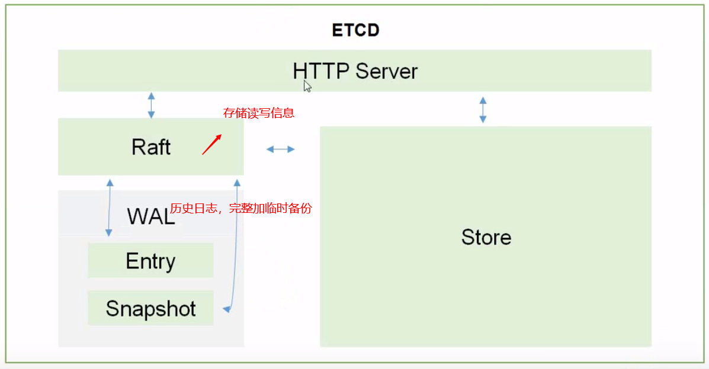

# K8S组件说明

## Google Borg架构

- BorgMaster：请求分发  -集群 最好保持在三个以上的奇数，防止脑裂
- Borglet：工作节点  提供计算能力
-  集群调度管理方式： configfile -> borgcgf    command-line tools    web browsers

---

## K8S架构

- scheduler：调度器  选择合适的节点，任务分散到Node里
- replication controller：控制器 维护副本期望值（数量）
- api server：**所有**服务访问的入口
- ectd：键值对数据库 可信赖的分布式键值存储服务（天然集群）->数据持久化
  - v2数据直接写入内存
  - v3可以持久化到本地数据库，不会造成数据丢失

- kublet: 与容器引擎进行交互，维持Pod的生命周期
- kube proxy: 负责service的实现，具体来说，就是实现了内部从pod到service和外部的从node port向service的访问，IPVS负载均衡
- CoreDNS：为集群中的SVC创建一个域名IP对应关系解析
- Dashboard: 提供B/S访问
- INGRESS CONTROLLER：实现七层代理
- FEDERATION：提供一个可以跨级群中心多k8s统一管理
- ELK： k8s日志分析

