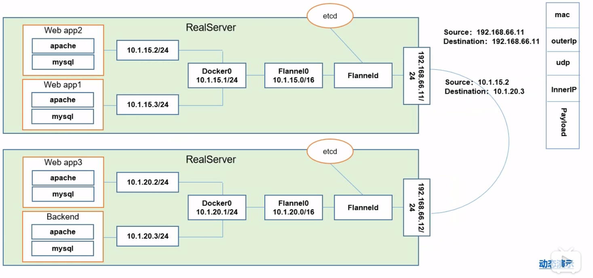
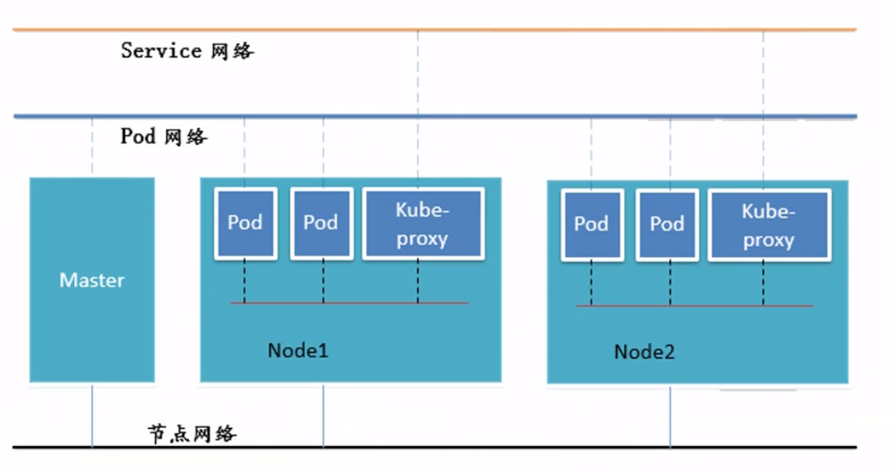

# Pod

## Pod概念

- 自主式Pod
- 控制器管理的Pod

区别：是否被控制器管理，不被控制器管理的Pod死亡之后不会有组件对Pod进行重启或删除，不会有replication controller维持期望值

传统情况下 移植容器时组件间有联系，可以相互访问，迁移容器需要重新配置

只要有Pod，pause容器就会被启动，多个Pod共享pause和存储卷

## Pod控制器类型

### RC(Replicat ionController)

- Replicat ionController用来确保容器应用的副本数始终保持在用户定义的副本数，即如果有容器异常退出，会自动创建新的Pod来替代;而如果异常多出来的容器也会自动回收。
- 在新版本的Kubernetes 中建议使用Repl icaSet来取代ReplicationControlle ReplicaSet跟Repl icationController没有本质的不同，只是名字不一样，并且ReplicaSet支持集合式的selector
- 虽然ReplicaSet 可以独立使用，但一般还是建议使用Deployment 来自动管理ReplicaSet，这样就无需担心跟其他机制的不兼容问题(比如ReplicaSet 不支持rolling update但Deployment 支持)
  - 版本更新时，Deployment会创建新的RS(ReplicaSet)，对老旧版本的Pod进行复制，复制完成后停用旧的RS，出现错误进行回滚时会启用旧版本

### HPA(Horizontal Pod Autoscaling)

- **HPA**(Horizontal Pod Autoscaling)仅适用于Deployment 和ReplicaSet ,在v1版本中仅支持根据Pod的CPU 利用率扩所容，在v1alpha 版本中，支持根据内存和用户自定义的metric 扩缩容

### StatefulSet

- **StatefulSet**是为了解决有状态服务的问题(对应Deployments 和Repl icaSets是为无状态服务而设计)，其应用场景包括:
  - 稳定的持久化存储，即Pod重新调度后还是能访问到相同的持久化数据，基于PVC来实现
  - 稳定的网络标志，即Pod重新调度后其PodName 和HostName 不变，基于Headless Service(即没有Cluster IP的Service )来实现
  - 有序部署，有序扩展，即Pod是有顺序的，在部署或者扩展的时候要依据定义的顺序依次依次进行(即从0到N-1,在下一个Pod运行之前所有之前的Pod必须都是Running 和Ready 状态)，基于init containers 来实现
    *有序收缩，有序删除(即从N-1到0)

### DaemonSet

DaemonSet确保全部(或者一些) Node. 上运行一个 Pod的副本。当有Node加入集群时，也会为他们新增一个Pod。当有Node从集群移除时，这些Pod也会被回收。删除DaemonSet将会删除它创建的所有Pod
使用DaemonSet 的一些 典型用法: 

- 运行集群存储daemon, 例如在每个Node. 上运行glusterd、 ceph。
- 在每个Node. 上运行日志收集daemon, 例如f luentd、logstash。
- 在每个Node.上运行监控daemon, 例如Prometheus Node Exporter
- 基于init containers 来实现

### JOB

Job负责批处理任务，即仅执行一次的任务，它保证批处理任务的一一个或多个Pod成功结束Cron Job管理基于时间的Job, 即:

- 在给定时间点只运行一次
- 周期性地在给定时间点运行

## 网络通信方式

Kubernetes的网络模型假定了所有Pod都在一个可以直接连通的扁平的网络空间中（所有的Pod都可以通过对方的IP直接到达），这在GCE (Google Compute Engine)里面是现成的网络模型，Kubernetes 假定这个网络已经存在。而在私有云里搭建Kubernetes 集群，就不能假定这个网络已经存在了。我们需要自己实现这个网络假设，将不同节点上的Docker 容器之间的互相访问先打通，然后运Kubernetes

- 同一个Pod中的容器： 共用一个pause，通过localhost访问 同一个Pod共享同一个网络命名空间，共享同一个Linux协议栈
- 各个Pod之间的通信：Overlay NetWork（全覆盖网络）两个Pod不在同一台主机，Pod(IP: 10.1.15.2) 地址与Docker0(IP: 10.1.15.1)在同一个网段 但是Docker0网段与宿主机网卡(IP: 192.168.66.11)不在同一个网段，不同Node之间的通信只能通过宿主机网卡进行。将Pod的IP和所在的Node的IP关联起来 ，通过这个关联让Pod可以相互访问。
- 同一个Docker中的Pod通过 docker的网桥通信
- Pod和service之间的通信：Iptables规则   新版本LVS
- Pod到外网: Pod向外网发送请求，查找路由表，转发数据包到宿主机的网卡，宿主网卡完成路由选择后，iptables执
  行Masquerade，把源IP更改为宿主网卡的IP,然后向外网服务器发送请求
- 外网访问Pod: Service

Flannel是CoreOS 团队针对Kubernetes 设计的一个网络规划服务，简单来说，它的功能是让集群中的不同节点主机创建的Docker容器都具有全集群唯--的虚拟IP地址。而且它还能在这些IP地址之间建立一个覆盖网络(OverlayNetwork)，通过这个覆盖网络，将数据包原封不动地传递到目标容器内

解释 由10.1.15.2到10.1.20.3的过程

ETCD之Flannel 提供说明:

> 存储管理 Flannel可分配的IP地址段 资源
> 监控ETCD中每个Pod的实际地址，并在内存中建立维护Pod节点路由表不动地传递到目标容器内

只有节点网络是真实的